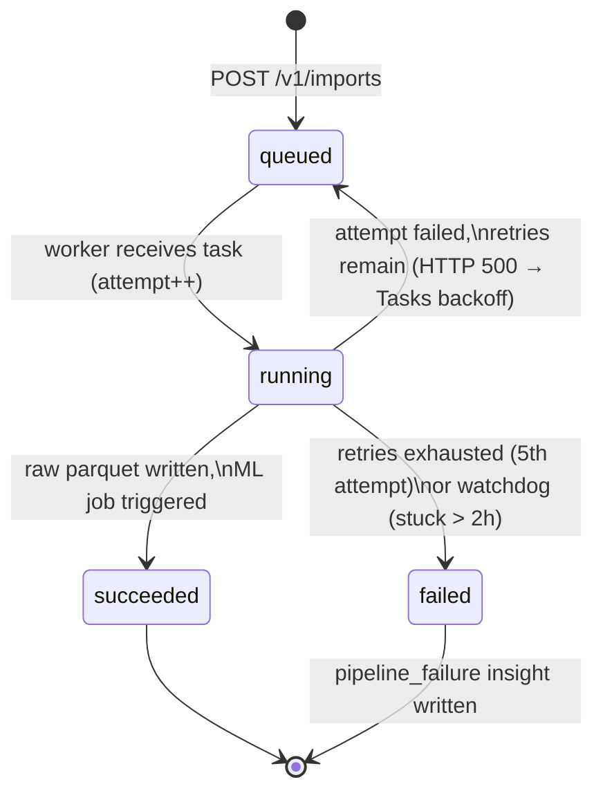

# PIPELINE — orchestration, retries, and the job state machine

## Trigger paths

1. **Cloud Scheduler** (per connector, default daily 02:00 IST) → `POST /v1/imports`
   with a Google OIDC token minted as `intel-scheduler@…`. The API accepts this
   service-to-service path **only** for imports; the connector row defines the tenant.
2. **Dashboard click** → same endpoint with a Clerk session JWT (tenant-scoped).

Both create a `jobs` row (`type=import, status=queued`) and enqueue a Cloud Tasks
task whose payload is `{job_id}` only.

## Job state machine



Identical machine for `type=ml` jobs (created by `intel-ml` itself): `running`
on start, `succeeded`/`failed` on exit; ML jobs are not retried by Tasks — a
re-run is a new execution over the same immutable raw data.

## Retry semantics (import-jobs queue ↔ worker contract)

| Layer | Setting |
|---|---|
| Cloud Tasks queue | max-attempts **5**, backoff 10s → 300s, max-doublings 4, concurrency 5 |
| Worker, transient failure | records `error`, sets status back to `queued`, returns **500** → Tasks retries |
| Worker, final attempt (`X-CloudTasks-TaskRetryCount` ≥ 4) | status `failed`, returns **200** (acks; stops retries), writes `pipeline_failure` insight |
| Worker, unknown/malformed/finished job | returns **200** ack-and-drop (idempotent no-op) |

Dead-letter behavior is therefore in-band: a permanently failed job is visible
as `jobs.status=failed` **and** as a `severity=critical` insight of kind
`pipeline_failure` in the dashboard feed.

## Watchdog

Cloud Scheduler (hourly) → `POST {worker}/tasks/watchdog` (OIDC, private service).
Any job in `running` with `started_at` older than **2h** is marked `failed`
(`error: watchdog: stuck in running > 2h`) and gets a `pipeline_failure` insight.
Covers worker crashes/timeouts where neither success nor failure was recorded.

## Idempotency invariants

- Raw paths embed `job_id` → retries overwrite their own partial output, never
  another job's data; replays use a new `job_id`.
- A re-delivered task for a `succeeded`/`failed` job is a 200 no-op.
- All Neon writes are UPSERTs on natural keys (`agent_traffic_daily`:
  tenant+date+source+agent; `forecasts`: tenant+metric+horizon; `insights`:
  job+kind).
- Neon is a serving mirror — `derived/` in GCS is the source of truth and can
  rebuild it at any time.

## Operational commands

```bash
# trigger a cron manually
gcloud scheduler jobs run intel-import-<short> --location asia-south1

# watch the chain
gcloud run services logs read intel-worker --region asia-south1 --limit 50
gcloud run jobs executions list --job intel-ml --region asia-south1

# replay a failed import (new job, same connector)
curl -X POST {API_URL}/v1/imports -H "Authorization: Bearer <clerk-jwt>" \
  -H 'Content-Type: application/json' -d '{"connector_id":"<id>"}'
```
